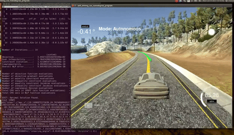

## Model Predictive Control
[](http://www.udacity.com/drive)
---
In this project Model Predictive Control is implemented to drive the car around the track. As an additionnal challenge, there's a 100 millisecond latency between actuations commands on top of the connection latency between my code and the simulator.

More information is only accessible by people who are already enrolled in Term 2 of CarND. If you are enrolled, see [the project page](https://classroom.udacity.com/nanodegrees/nd013/parts/40f38239-66b6-46ec-ae68-03afd8a601c8/modules/f1820894-8322-4bb3-81aa-b26b3c6dcbaf/lessons/b1ff3be0-c904-438e-aad3-2b5379f0e0c3/concepts/1a2255a0-e23c-44cf-8d41-39b8a3c8264a) for more details.


---
Rubric Points
---

See the [rubric points](https://review.udacity.com/#!/rubrics/896/view) for this project.
 
### 1. The model
 
##### Kinematic model


where:

* x is the current location in the x-axis
* y is the current location in the y-axis
* psi is the heading of the car
* v is the current velocity of the car
 
The Kinematic Model of the car can then be described as follow:
```sh
x[t+1] = x[t] + v[t] * cos(psi[t]) * dt
y[t+1] = y[t] + v[t] * sin(psi[t]) * dt
psi[t+1] = psi[t] + v[t] * (-delta[t]) / Lf * dt
v[t+1] = v[t] + a[t] * dt
```

The goal of our controler is to be able to minimize the area between the reference trajectory and the vehicle's actual path.

We can minimize this error by predicting the vehicle's actual path and then adjusting the control inputs to minimize the difference between that prediction and the reference trajectory.

In order to predict the area between the trajectory and the predicted path of the vehicle we will need to also include the following error model in our state vector.

The error model:
```sh
cte[t+1] = (f[x[t]] - y[t]) + (v[t] * sin(epsi[t]) * dt)
epsi[t+1] = (psi[t] - psides[t]) + v[t] * (-delta[t]) / Lf * dt
```
where

```sh
cte[t]   //  the cross-track error
epsi[t]  // the orientation error
delta[t] // the steering command
a[t]     // the acceleration command
f[x[t]]  // the trajectory fitted polynomial expressed in the vehicle frame
f'[x[t]] // the derivative according to x[t] of f[x [t]]
psides[t] = atan(f'[x[t]])
```


### 2. Timestep Length and Elapsed Duration (dt & N)

The elapsed duration (`N * dt`) inflences the prediction horizon, the timesteps number (`N`) inflences the computation time and the timestep lenght (`dt`) influences the accuracy. 

The greater `N` or `dt` are, further in the future the prediction will be computed.
The greater `N`is, the greater the computation time will be.
The smaller `dt` is, the greater the accuracy will be.

In general, I observed that N needs to be large enough to allow convergence but not so large that the prediction can't be computed in real-time. 

Another consideration is that the further in the future we look, the less accurate our simplified model becomes..

For my first few try I went with `N=10` and `dt=0.1s` at the suggestion of the project's Q&A (link available in the Slack #p-mpc channel) for a prediction horizon of 1.0s.

The I tried to get a faster and more stable car arround the track so I played with the values a little. 

The values chosen for N and dt are `12` and `0.125s`, respectively for a prediction horizon of 1.5s. I also tried `N=20` & `dt = 0.15`, `N=15` & `dt = 0.1`, `N=15` &`dt = 0.15`, `N=8` &`dt=0.1`, `N=6` &`dt=0.1` etc.. 

### 3. Polynomial Fitting and MPC Preprocessing

The waypoints feeded by the simulator are expressed in the global frame. The first step I had to do is to convert them into the vehicle frame. The resulting state vector then becomes : `{0, 0, 0, v, cte, epsi}` which greatly simplifies  the following calculations. A 3rd degree polynomial is then fitted on those converted waypoints.

```sh
/*
 *  Convert the waypoints to the vehicle frame
 */
for(int i = 0; i < ptsx.size(); ++i) {

  double shift_x = ptsx[i] - px;
  double shift_y = ptsy[i] - py;

  ptsx[i] = shift_x * cos(0-psi) - shift_y * sin(0-psi);
  ptsy[i] = shift_x * sin(0-psi) + shift_y * cos(0-psi);
}
```

### 4. Model Predictive Control with Latency

In order to deal with the actuators latency, I decided to use our kinamtic and error model to compute the future state of the vehicle. This future state is then feeded as the actual state to the MPC controller. This resulted in a greatly improved stability and tracking ability of the controller.

```sh
/*
 *  Simulate the car state in the future to take into account the latency
 */
Eigen::VectorXd simulation(Eigen::VectorXd state, Eigen::VectorXd coeffs, double delta0, double a0, double dt){

  const double Lf = 2.67;

  // Present state of the car
  double x0    = state[0];
  double y0    = state[1];
  double psi0  = state[2];
  double v0    = state[3];
  double cte0  = state[4];
  double epsi0 = state[5];

  double x1      = (x0 + v0 * cos(psi0) * dt);
  double y1      = (y0 + v0 * sin(psi0) * dt);
  double psi1    = (psi0 - v0 * delta0 / Lf * dt);
  double v1      = (v0 + a0 * dt);
  double cte1    = (cte0 + (v0 * sin(epsi0) * dt));
  double epsi1   = (epsi0 - v0 * delta0 / Lf * dt);

  Eigen::VectorXd state_future(6);
  state_future << x1, y1, psi1, v1, cte1, epsi1;

  return state_future;
}
```

## Final result

[]()

## Dependencies

* cmake >= 3.5
 * All OSes: [click here for installation instructions](https://cmake.org/install/)
* make >= 4.1
  * Linux: make is installed by default on most Linux distros
  * Mac: [install Xcode command line tools to get make](https://developer.apple.com/xcode/features/)
  * Windows: [Click here for installation instructions](http://gnuwin32.sourceforge.net/packages/make.htm)
* gcc/g++ >= 5.4
  * Linux: gcc / g++ is installed by default on most Linux distros
  * Mac: same deal as make - [install Xcode command line tools]((https://developer.apple.com/xcode/features/)
  * Windows: recommend using [MinGW](http://www.mingw.org/)
* [uWebSockets](https://github.com/uWebSockets/uWebSockets)
  * Run either `install-mac.sh` or `install-ubuntu.sh`.
  * If you install from source, checkout to commit `e94b6e1`, i.e.
    ```
    git clone https://github.com/uWebSockets/uWebSockets 
    cd uWebSockets
    git checkout e94b6e1
    ```
    Some function signatures have changed in v0.14.x. See [this PR](https://github.com/udacity/CarND-MPC-Project/pull/3) for more details.
* Fortran Compiler
  * Mac: `brew install gcc` (might not be required)
  * Linux: `sudo apt-get install gfortran`. Additionall you have also have to install gcc and g++, `sudo apt-get install gcc g++`. Look in [this Dockerfile](https://github.com/udacity/CarND-MPC-Quizzes/blob/master/Dockerfile) for more info.
* [Ipopt](https://projects.coin-or.org/Ipopt)
  * Mac: `brew install ipopt`
  * Linux
    * You will need a version of Ipopt 3.12.1 or higher. The version available through `apt-get` is 3.11.x. If you can get that version to work great but if not there's a script `install_ipopt.sh` that will install Ipopt. You just need to download the source from the Ipopt [releases page](https://www.coin-or.org/download/source/Ipopt/) or the [Github releases](https://github.com/coin-or/Ipopt/releases) page.
    * Then call `install_ipopt.sh` with the source directory as the first argument, ex: `bash install_ipopt.sh Ipopt-3.12.1`. 
  * Windows: TODO. If you can use the Linux subsystem and follow the Linux instructions.
* [CppAD](https://www.coin-or.org/CppAD/)
  * Mac: `brew install cppad`
  * Linux `sudo apt-get install cppad` or equivalent.
  * Windows: TODO. If you can use the Linux subsystem and follow the Linux instructions.
* [Eigen](http://eigen.tuxfamily.org/index.php?title=Main_Page). This is already part of the repo so you shouldn't have to worry about it.
* Simulator. You can download these from the [releases tab](https://github.com/udacity/self-driving-car-sim/releases).
* Not a dependency but read the [DATA.md](./DATA.md) for a description of the data sent back from the simulator.


## Basic Build Instructions


1. Clone this repo.
2. Make a build directory: `mkdir build && cd build`
3. Compile: `cmake .. && make`
4. Run it: `./mpc`.
