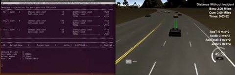

# CarND-Path-Planning-Project
Self-Driving Car Engineer Nanodegree Program
   
### Simulator.
You can download the Term3 Simulator which contains the Path Planning Project from the [releases tab](https://github.com/udacity/self-driving-car-sim/releases).

### Goals
In this project the goal is to safely navigate around a virtual highway with other traffic that is driving +-10 MPH of the 50 MPH speed limit. We are provided with the car's localization and sensor fusion data, there is also a sparse map list of waypoints around the highway. The car should try to go as close as possible to the 50 MPH speed limit, which means passing slower traffic when possible, note that other cars are also trying to change lanes. The car should avoid hitting other cars at all cost as well as driving inside of the marked road lanes at all times, unless going from one lane to another. The car should be able to make one complete loop around the 6946m highway. Since the car is trying to go 50 MPH, it should take a little over 5 minutes to complete 1 loop. Also the car should not experience total acceleration over 10 m/s^2 and jerk that is greater than 50 m/s^3.

#### The map of the highway is in data/highway_map.txt
Each waypoint in the list contains  [x,y,s,dx,dy] values. x and y are the waypoint's map coordinate position, the s value is the distance along the road to get to that waypoint in meters, the dx and dy values define the unit normal vector pointing outward of the highway loop.

The highway's waypoints loop around so the frenet s value, distance along the road, goes from 0 to 6945.554.

## Basic Build Instructions

1. Clone this repo.
2. Make a build directory: `mkdir build && cd build`
3. Compile: `cmake .. && make`
4. Run it: `./path_planning`.

Here is the data provided from the Simulator to the C++ Program

#### Main car's localization Data (No Noise)

["x"] The car's x position in map coordinates

["y"] The car's y position in map coordinates

["s"] The car's s position in frenet coordinates

["d"] The car's d position in frenet coordinates

["yaw"] The car's yaw angle in the map

["speed"] The car's speed in MPH

#### Previous path data given to the Planner

//Note: Return the previous list but with processed points removed, can be a nice tool to show how far along
the path has processed since last time. 

["previous_path_x"] The previous list of x points previously given to the simulator

["previous_path_y"] The previous list of y points previously given to the simulator

#### Previous path's end s and d values 

["end_path_s"] The previous list's last point's frenet s value

["end_path_d"] The previous list's last point's frenet d value

#### Sensor Fusion Data, a list of all other car's attributes on the same side of the road. (No Noise)

["sensor_fusion"] A 2d vector of cars and then that car's [car's unique ID, car's x position in map coordinates, car's y position in map coordinates, car's x velocity in m/s, car's y velocity in m/s, car's s position in frenet coordinates, car's d position in frenet coordinates. 

---

## Dependencies

* cmake >= 3.5
 * All OSes: [click here for installation instructions](https://cmake.org/install/)
* make >= 4.1
  * Linux: make is installed by default on most Linux distros
  * Mac: [install Xcode command line tools to get make](https://developer.apple.com/xcode/features/)
  * Windows: [Click here for installation instructions](http://gnuwin32.sourceforge.net/packages/make.htm)
* gcc/g++ >= 5.4
  * Linux: gcc / g++ is installed by default on most Linux distros
  * Mac: same deal as make - [install Xcode command line tools]((https://developer.apple.com/xcode/features/)
  * Windows: recommend using [MinGW](http://www.mingw.org/)
* [uWebSockets](https://github.com/uWebSockets/uWebSockets)
  * Run either `install-mac.sh` or `install-ubuntu.sh`.
  * If you install from source, checkout to commit `e94b6e1`, i.e.
    ```
    git clone https://github.com/uWebSockets/uWebSockets 
    cd uWebSockets
    git checkout e94b6e1
    ```


## Rubric points

#### Provide a reflection on how to generate paths

The final approach I used for trajectory generation was based on the walkthrough video. The spline approach isn't as neat and elegant as the Jerk Minimizing Spline method but it was way easier and was able to effectively drive the vehicle in the simulator to meet requirements. Once I figured out the basic waypoints generation, I adapted the classes and methods that I already coded to solve the extremely difficult lesson's 4.16 quizz. 

##### Implementation summary

The ego vehicle state and its associated (self-explanatory) methods are contained in the Vehicle class. These methods include `update_FSM_state`, which update the finite state machine state (i.e. "keep lane", "lane change left", "lane change right"), `_trajectory_for_FSM_state`,  `realize_FSM_state`,  `generate_predictions`,etc..).

The ego vehicle object is first created and then included to a global list of vehicles. Then the sensor fusion data is parsed and vehicle objects are created and included to the list for each vehicle reported. 

Trajectories for each of the car in the list are then generated (lines 292-302 of `main.cpp`). These trajectories are assuming constant accelerations and no lane change. 

Using the update_FSM_state (line 310 of `main.cpp`), each possible Finite State Machine state is explored by generating teh corresponding ego vehicle trajectory (lines 141-154 of `vehicle.cpp`) taking into account the predictions of all the other vehicles.

A set of cost functions is then used to determine what is the best trajectory for the ego car. These cost functions include (see `cost.cpp`):

* `change_lane_cost` :  penalizes lane changes and penalizes driving in any lane other than the center.
* `inefficiency_cost` : penalizes lower/higher speed than requested (22.21m/s ~ 49.68mph).
* `collision_cost` : penalizes a trajectory that collides with any predicted vehicle trajectories.
* `buffer_cost` : penalizes a short distance between ego vehicle and closest vehicle in front.

Once the FSM state is chosen, the `realize_FSM_state` (line 335 of `main.cpp`) method of the ego vehicle is called. The method updates the acceleration setpoint and the lane setpoint by taking into account the predicted trajectories of the other cars. Then the speed setpoint is updated accordingly (line 352 of `main.cpp`). In the end, the last thing left to do is to generate a Jerk minimizing trajectory to send to the simulator.

The track center's waypoints are given in the highway_map.csv file. So the first step in the process of generating such a trajectory is to compute a set of widely spaced nearby waypoints ahead of the ego vehicle. These waypoints will then be interpolated using the "spline.h" helper header file. 

The simulator returns instantaneous telemetry data for the ego vehicle, but it also returns the list of points from previously generated path. The latter is used as a starting point for the newly generated path. In fact, the two first waypoints of the new trajectory always overlaps with the last points of the previous path in order to ensure a smooth connection between the 2 (see lines 366-395 of `main.cpp`). Then 3 more waypoints are generated along the highway according to the desired target lane and the highway map with 30m between each points.

The trajectory being fed to the simulator is always 50 points long (lines 450-471 of `main.cpp`). The first points are composed of the previous path. The remaining points are the result of the spline interpolation of the 5 generated waypoints. Finaly, the interpolated points are being spaced according to the speed setpoint.

##### Conclusion

The resulting path planner works well, but not perfectly. It has managed to accumulate incident-free runs of over ten miles multiple times, and once navigating the track incident-free for over twenty miles. I think that it satifies the requirements for this project.

## Final Result
Up to 16miles wihout incidents (acceleration/jerk limit violation).


Video of a complete lap.

<a href="https://www.youtube.com/watch?v=dCEQEot9mAM">
   
</a>

