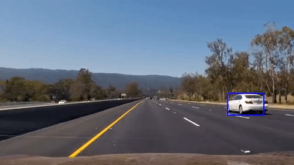

## Vehicle Detection and Tracking
[](http://www.udacity.com/drive)

In this project, the goal is to write a software pipeline to identify vehicles in a video from a front-facing camera on a car. 

Here are links to the labeled data for [vehicle](https://s3.amazonaws.com/udacity-sdc/Vehicle_Tracking/vehicles.zip) and [non-vehicle](https://s3.amazonaws.com/udacity-sdc/Vehicle_Tracking/non-vehicles.zip) examples on which the classifier was trained.  These example images come from a combination of the [GTI vehicle image database](http://www.gti.ssr.upm.es/data/Vehicle_database.html), the [KITTI vision benchmark suite](http://www.cvlibs.net/datasets/kitti/), and examples extracted from the project video itself.

The Project
---

**Vehicle Detection Project**

Since I opted for a deep learning (DL) approach for this problem instead of using the classical computer vision (CV) techniques showed in Udacity's lessons, the project steps are a bit differents from those suggested. Please note I had the approval of Ryan Keenan to use this approach...

The goals / steps of this project were the following:

1. Normalize the features and randomize a selection for training and testing.
2. Design and train a convolutionnal network (ConvNet) as an image classifier, using the supplied dataset.
3. Use the resulting weights in a full ConvNet to output a feature map, used as a heatmap.
4. Detect "hot windows" inside the heatmap and convert the heatmap coordinates to the original image coordinates.
5. Run the pipeline on a video stream and create a heat map of recurring detections frame by frame to reject outliers and follow detected vehicles.
6. Estimate a bounding box for vehicles detected.


## Rubric Points
 Since the [rubric points](https://review.udacity.com/#!/rubrics/513/view) were designed for the original project, I'll try my best to  describe how I addressed my implementation while keeping the original rubric structure.

---
### Writeup / README

#### 1. Provide a Writeup / README that includes all the rubric points and how you addressed each one.  You can submit your writeup as markdown or pdf.  [Here](https://github.com/udacity/CarND-Vehicle-Detection/blob/master/writeup_template.md) is a template writeup for this project you can use as a guide and a starting point.  

You're reading it!


### Histogram of Oriented Gradients (HOG)

#### 1. Explain how (and identify where in your code) you extracted HOG features from the training images.

Since, I went for the deep learning approach, I did not have to explore color spaces to get the best HOG features. Everything is taken care of into by the training process. Raw RGB images are thus used as an input to the classifier.

#### 2. Explain how you settled on your final choice of HOG parameters.

I did not need to make a choice since it is taken car of automaticaly by the training process.

#### 3. Describe how (and identify where in your code) you trained a classifier using your selected HOG features (and color features if you used them).

##### Dataset import
I started by reading in all the `vehicle` and `non-vehicle` images. The code for this step is contained in the 2nd, 3rd and 4th code cell of the [Train IPython notebook](./P5-TrainModel.ipynb).
Here is a visualisation of a random sample of the dataset:


##### Training data and validation split
Then I randomly splitted the the dataset into a training (90%) and a validation set (10%). 

##### Classes balance
Then I made sure the data set was well balanced between both classes (see the 4th code cell). Here is a bar chart showing how the data is distributed accross both classes.


##### Data preprocessing
Then, no preprocessing is used other than a normalizing layer embeded into the model's first layer (Keras lambda layer).

#### Classifier's architecture
As stated in the lesson, in a traditional CV setup I would have had to run my classifier accross all possible locations inside the image. A slidding window technique would have been the way to do it along with some initial guesses (tracking the car and estimating its next position) to reduce the search load. 

Since I was already planning to use a some sort of convolutionnal network as a classifier. It didn't seemed very efficient to use my GPU to slide trough the image and the feature maps multiple time on top of slidding trough the image.

I then started looking at a couple of Deep Learning approach I could implement like YOLO (You Only Look Once), SSD, (Single Shot MultiBox Detector), U-net. I was looking at something simple to implement which would be able to run the detection process entirely on my GPU (for faster execution).

Then I stumbled upon one of the `#p-vehicle-detection` Slack channel pinned item, it was [Max Ritter's](https://github.com/maxritter/SDC-Vehicle-Lane-Detection) implementation of a fully convolutionnal network for Vehicle Detection. The implementation seemed easy enough and I decided to give it a try and start looking for more information. 

##### Fully Convolutionnal Network

As we have seen in the "intro to convolutionnal network" lesson, a nice property of a convolutional filter is that is reuses the same weights while slidding through the image and feature maps, the weight number is thus not dependent on the input image size. Therefore, it is possible to train a full ConvNet to classify small size images (64x64) as an image classifier (like we have done for Project 2) and output the result on one neuron.

In our case the output will be either there is a car in the image or not (tanh=1 or tanh=-1). The weights resulting from the training can then be reused on the same full ConvNet to build an output feature map from larger images. This feature map can be seen as a heatmap in which each pixel represents the output of the original trained ConvNet for a section of the input image. These pixels thus give the "car probability" for a specific location in the input image. 

As stated by Philippe Weingertner:
> This approach is typically used as the basis of segmentation, to build heatmaps [...]. But instead of performing segmentation we will use the heatmap built by this fully convolutionnal network, to detect objects, on the heat areas.

This approach was used in this [paper](https://people.eecs.berkeley.edu/~jonlong/long_shelhamer_fcn.pdf) from Jonathan Long, Evan Shelhamer and Trevor Darrel (see also this [presentation](http://tutorial.caffe.berkeleyvision.org/caffe-cvpr15-pixels.pdf)). Also in this [paper](https://arxiv.org/pdf/1412.6806.pdf) from Jost Tobias Springenberg, Alexey Dosovitskiy, Thomas Brox and Martin Riedmiller.


In my personnal opinion the process of computing the heatmap is more efficient than using the slidding window approach because of what I would call: "computed data reutilisation". This is made possible by the intermediary features maps, which I feel, are acting as intermediary computed data buffers.

##### Model's architecture

The model's architecture was chosen and downsized from the work of [Max Ritter](https://github.com/maxritter/SDC-Vehicle-Lane-Detection), [Philippe Weingertner](https://github.com/PhilippeW83440) and [Henrik Tünnermann](https://github.com/HTuennermann) : all of them being fellow CarND students.
 
Here is my ConvNet chosen architecture:


The code for the model definition is located in the 5th code cell of the [Train IPython notebook](./P5-TrainModel.ipynb) and in the [*model.py file*](./model.py).

```sh
Layer (type)                 Output Shape              Param #   
=================================================================
lambda_1 (Lambda)            (None, 64, 64, 3)         0         
_________________________________________________________________
conv2d_1 (Conv2D)            (None, 64, 64, 50)        1400      
_________________________________________________________________
dropout_1 (Dropout)          (None, 64, 64, 50)        0         
_________________________________________________________________
conv2d_2 (Conv2D)            (None, 64, 64, 50)        22550     
_________________________________________________________________
dropout_2 (Dropout)          (None, 64, 64, 50)        0         
_________________________________________________________________
conv2d_3 (Conv2D)            (None, 64, 64, 50)        22550     
_________________________________________________________________
max_pooling2d_1 (MaxPooling2 (None, 8, 8, 50)          0         
_________________________________________________________________
dropout_3 (Dropout)          (None, 8, 8, 50)          0         
_________________________________________________________________
conv2d_4 (Conv2D)            (None, 1, 1, 90)          288090    
_________________________________________________________________
dropout_4 (Dropout)          (None, 1, 1, 90)          0         
_________________________________________________________________
conv2d_5 (Conv2D)            (None, 1, 1, 1)           91        
_________________________________________________________________
flatten_1 (Flatten)          (None, 1)                 0         
=================================================================
Total params: 334,681
Trainable params: 334,681
Non-trainable params: 0
```

The code for training the classifier is located in the 7th code cell of [Train IPython notebook](./P5-TrainModel.ipynb). The model was trained over 30 epochs. The Adam optimizer was chosen and Mean Squared Error was used as a loss function A Keras checkpointer was declared and configured to save the weights if loss becomes lower than the lowest loss to date. The checkpointer is called via the callback parameter and is executed after each epoch. 


Best loss was : `0.01573` and associated accuracy was : `0.9921`.

A quick test confirms the model is working properly (see 9th code cell) : 


###Sliding Window Search

#### 1. Describe how (and identify where in your code) you implemented a sliding window search.  How did you decide what scales to search and how much to overlap windows?

##### Slidding window search
As stated before, the slidding window is sort of natural property of the convolutionnal network and I didn't have to personnaly implement that since I leveraged Keras and Tensorflow implementations. 

##### Scaling and Regions of interest (ROIs)
Like in the case of the traditional CV methods, the scale will influence the network's ability to classify. Since the classifier was trained on 64x64 car/non-car images, I had to specify a few scales to search on.

I decided to restrict specific scale search to specific zones in the image so I defined region of interest (ROIs) which are shown in the figure below overlaid over my 10 tests images. The idea is that the further down in the image the car is, the closer it is and thus the bigger it will appear to the camera. The code for this step is located in the 3rd code cell of the [Vehicle Detection IPython notebook](./P5-VehicleDetection.ipynb).


Three ROIs were defined:

|ROI|Vertice| X | Y |Scaling|
|:--:|:------:|:--:|:--:|:--:|
|1|Upper Left| 0| 430|0.62|
|1|Lower Right| 1280|640|0.62|
|2|Upper Left| 0| 390|0.91|
|2|Lower Right| 1280|506|0.91|
|3|Upper Left| 230| 400|1.55|
|3|Lower Right| 1050|483|1.55|

The ROI and scaling factor tunning process was iterative to acheive best results. As a starting point, I divided the image into 3 zones based on my feeling of where I tought it would achieve the best results. Then I tried to measure a typical car height in pixel inside each of these zones. I then found my scaling factors by dividing the original feature height (I chose 62 pixels instead of 64) by the height in each ROIs. 

Then I computed the number of 64x64 windows I could fit in height after scaling inside each ROI and readjusted the ROIs to get as close as possible to an integer number of 64x64 windows. I repeated the whole process a couple of times to get good results...

##### Inference pipeline

The code for this step is located in the 8th code cell of the [Vehicle Detection IPython notebook](./P5-VehicleDetection.ipynb).

I then defined the `inference_pipeline()` function which returns a list of hot window which act just as the `search_window()` function specified in lesson 34. 

The image is first cropped to the roi's dimension, then resized with the scaling factor and finaly fed into the classifier. The latter returns the a feature map treated a an heatmap, the `find_cars()` function is then run to compute the candidate bounding boxes coordinates in the original image pixel space (see following paragraph). The following figure shows the bounding boxes candidates drawn over the original image.


##### Candidate Bounding boxes (bboxes)

The code for this step is located in the 7th code cell of the [Vehicle Detection IPython notebook](./P5-VehicleDetection.ipynb).

The `find_car()` function takes in the raw ConvNet outputed heat map, the roi, the scaling and returns a list of candidates bounding boxes (hot windows) coordinates scaled into the original image space. 
The scale difference between the original image and heatmap is due to the 8x8 max pooling at the end of my network and to the scaling applied before inference.

#### 2. Show some examples of test images to demonstrate how your pipeline is working.  What did you do to optimize the performance of your classifier?

The code for this step is located in the 9th code cell of the [Vehicle Detection IPython notebook](./P5-VehicleDetection.ipynb).

Ultimately I used lesson 37 functions (`add_heat()`, `apply_threshold()` and `draw_labeled_bboxes()`) and to generate a heatmap from the candidates bounding boxes list (hot windows). The original lesson 37 pipeline was modified a bit to include a stack of past heatmaps which are summed up to get a smoother detection process. This enables me to combine the several overlaping bounding boxes of the current and past frames into one final heatmap, then thresholding is used to discard outliers and the SciPy function label is used to find the final bounding boxes arround the residual blobs.

The following figure shows the test images with their final bounding boxes and their associated heatmaps.


##### Optimisation steps

* The classifier number of trainable parameters was reduced as much as possible without affecting the final precision.

* Regions of interest was used to reduce the search space and better target the features to be found.

* Scaling was used to improve detection performance and reduce the ConvNet outputed feature map size.

Final inference time on a GTX 1080 Ti is arround 36ms which is 27.7fps.

---

### Video Implementation

#### 1. Provide a link to your final video output.  Your pipeline should perform reasonably well on the entire project video (somewhat wobbly or unstable bounding boxes are ok as long as you are identifying the vehicles most of the time with minimal false positives.)

[](https://youtu.be/zfHIdp_7_Fw)

Here's a link to [download](./output_videos/project_video_output.mp4) my project video result.


#### 2. Describe how (and identify where in your code) you implemented some kind of filter for false positives and some method for combining overlapping bounding boxes.

I recorded the positions of positive detections in each frame of the video.  From the positive detections I created a heatmap and summed it up with the heatmaps from the last 5 frames to get a smoother detection process. This enables me to combine the overlaping bounding boxes of the current and past frames into one final heatmap, then thresholding is used to discard outliers and the SciPy function label is used to find the final bounding boxes arround the residual blobs.

Here's an example result showing the heatmap from a series of frames of video, the result of `scipy.ndimage.measurements.label()` and the bounding boxes then overlaid on the last frame of video.

Here are 10 frames of the video and their corresponding heatmaps:


Here is the output of `scipy.ndimage.measurements.label()` on the integrated heatmap from the 5 last frames:


Here the resulting bounding boxes are drawn onto the last frame in the series:


---

###Discussion

#### 1. Briefly discuss any problems / issues you faced in your implementation of this project.  Where will your pipeline likely fail?  What could you do to make it more robust?

I had problems tuning the scaling and the region of interest while optimizing for speed. I found it's a balancing act between better accuracy and faster execution.

The pipeline seemed pretty robust in itself. I found no real lighting issues. 
I would say that the only issues would be the size down to witch the classifier can detect a car reliably and the fact that since the training examples only show back of cars, the classifier has difficulty detecting the side or the front of a car. Also, the bounding boxes were a bit jerky. 

To take the project further, I think I could have coded a tracker that take into account the dynamics of the observed cars. Also it would be nice to test other deep learning architectures (YOLO, SSD, UNet) and finaly I think my classifier needs a larger dataset with examples of cars seen from all differents angles.

